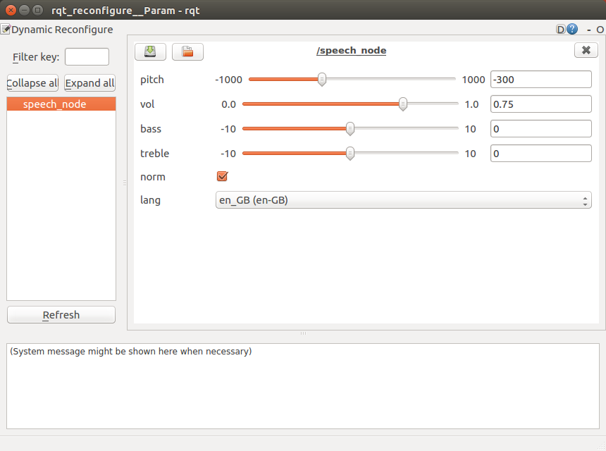

# speech
ROS node to turn text to speech (TTS). The node can either play an existing wav file or takes text, converts it to a temporary wav file and then plays that wav file. It uses pico2wave for the TTS and SoX (Sound eXchange) to play either the supplied wav file or the one generated by pico2wave.

## Running the Node

Once you have the node built, you can run it using the command `rosrun speech speech_node`. You must have installed pico2wave `sudo apt-get install libttspico-utils` and SoX `sudo apt-get install sox libsox-fmt-all`.

## Configuring the node with dynamic reconfigure

You can dynamically adjust the paramaters of the node using rqt_reconfigure. Start this application with `rosrun rqt_reconfigure rqt_reconfigure`. It will bring up a user interface like the one shown below. Paramaters can be dynamically adjusted via the interface. For example if you require a male voice then adjust the pitch. It should be noted that these parameters only affect the TTS and not the playback of existing wav files.

## Node Information
Topics:

* `/speech/say`:  
  Subscribes `speech/voice` with either text containing the words to speak or wav containing the path of the wav file to play.
  
* `/speech/talking_finshed`:  
  Publishes `std_msgs/String` to indicate that the talking or playback of the existing wav file is complete.
